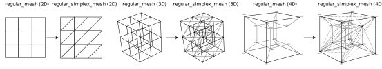

# Regular Simplex Mesh

A regular simplex mesh is based on the given regular mesh that consists of *n*-cubes.  We tesselate each *n*-cube into a number (*n!*) of *n*-simplices, as demonstrated below. 

